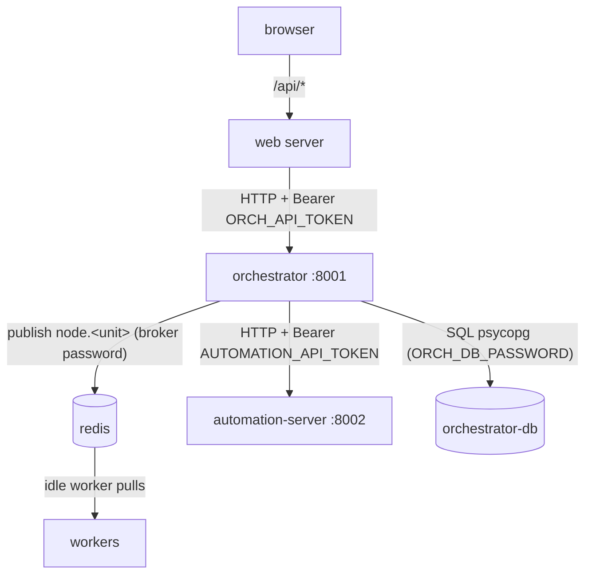

# Backend communication

How the components talk to each other, over which protocol, and how each hop is
authenticated.

## Components and ports

| Component | Process | Listens | Published by default |
|-----------|---------|---------|----------------------|
| web (browser) | Next.js client | - | - |
| web (server) | Next.js route handlers (`app/api/*`) | same-origin | 3000 |
| orchestrator | FastAPI (`ai-multi-agent-api`) | 8001 | 127.0.0.1:8001 |
| workers | Celery (`ai-multi-agent-workers`) | - (pulls from Redis) | - |
| redis | broker + result backend | 6379 | **not published** (internal only) |
| orchestrator-db | Postgres | 5432 | **not published** (internal only) |
| automation-server | FastAPI | 8002 | 127.0.0.1:8002 |

"Published by default" is the host port the compose files expose. Redis and
orchestrator-db are never exposed to a host port; they are reachable only inside
the compose network by service name (`redis`, `orchestrator-db`).

## Who calls whom

- The **browser never talks to a backend directly** and never sees a token. It
  calls same-origin `/api/*`; the Next.js server route proxies to the orchestrator.
- **web server -> orchestrator**: HTTP. Adds `Authorization: Bearer <ORCH_API_TOKEN>`
  via `orchHeaders()` in `web/src/lib/services.ts`.
- **orchestrator -> workers**: not a direct call. The orchestrator publishes a
  Celery task (`node.<unitId>`) to Redis; an idle worker pulls it. Redis requires
  the broker password (`REDIS_URL=redis://:<pw>@redis:6379/0`).
- **orchestrator -> automation-server**: HTTP `POST /invoke` then poll
  `GET /invoke/{runId}` (`shared/clients.py`). Adds
  `Authorization: Bearer <AUTOMATION_API_TOKEN>`.
- **orchestrator / workers -> orchestrator-db**: SQL over the Postgres protocol,
  authenticated by the DB password.

## Orchestrator HTTP API (port 8001)

Every route except `GET /health` requires the bearer token when `ORCH_API_TOKEN`
is set (see [security.md](security.md)).

| Method | Path | Purpose |
|--------|------|---------|
| GET | `/health` | liveness (no auth) |
| GET | `/catalog` | list AI/parser units for the builder |
| GET | `/agents` | per-agent busy/idle snapshot (shown in the session Agents panel) |
| POST | `/runs` | create + start a run; validates every `ai_agent` unitId |
| GET | `/runs/{id}` | run status + per-step input/output |
| POST | `/runs/{id}/resume` | continue a run paused for human review |
| GET | `/runs/{id}/events` | SSE stream of status updates |

## automation-server HTTP API (port 8002)

Every route except `GET /health` requires `AUTOMATION_API_TOKEN` when set.

| Method | Path | Purpose |
|--------|------|---------|
| GET | `/health` | liveness (no auth) |
| GET | `/catalog` | list automation tools |
| POST | `/invoke` | start a tool invocation; validates unitId |
| GET | `/invoke/{runId}` | poll invocation result |

## How the token check works

Both FastAPI apps register a global dependency (`_require_token`) that:

1. lets `GET /health` through unconditionally (so Docker health checks work),
2. does nothing if the token env var is empty (local dev, auth disabled),
3. otherwise requires `Authorization: Bearer <token>` and compares it in
   constant time (`hmac.compare_digest`) - returning 401 if the header is
   missing/malformed, 403 if the token is wrong.

Tokens are server-to-server secrets. They are set as environment variables and
must never be shipped to the browser.
