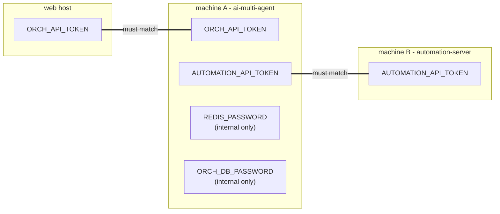

# Deployment

The two backend stacks are independent Compose projects, so they can run on the
same machine or on different machines.

## Files

| File | Stack | Services |
|------|-------|----------|
| `docker-compose.yml` (root) | all-in-one, single machine | redis, orchestrator-db, automation-server, ai-multi-agent-api, ai-multi-agent-workers |
| `ai-multi-agent/docker-compose.yml` | ai-multi-agent (machine A) | redis, orchestrator-db, api, workers |
| `automation-server/docker-compose.yml` | automation-server (machine B) | automation-server |

The web app is not containerized here; run it with `npm run dev` / a Node host,
or deploy to Vercel/etc. It only needs to reach the orchestrator.

## Option 1 - single machine (dev / demo)

```bash
cp .env.example .env       # fill REDIS_PASSWORD, ORCH_DB_PASSWORD, ORCH_API_TOKEN,
                           # AUTOMATION_API_TOKEN  (openssl rand -hex 32)
docker compose up --build -d
```

Only the orchestrator API is published (on `API_BIND`, default `127.0.0.1:8001`).
automation-server, redis and orchestrator-db stay on the internal network.

Web:

```bash
cd web
cp .env.example .env       # set DATABASE_URL (Neon), AI_MULTI_AGENT_URL=http://localhost:8001,
                           # ORCH_API_TOKEN = the same token as the backend
npm install && npm run db:push && npm run dev
```

## Option 2 - two machines (the split)

### Machine B - automation-server

```bash
cd automation-server
cp .env.example .env
#   AUTOMATION_API_TOKEN=<shared token>
#   AUTOMATION_BIND=0.0.0.0        # only if machine A reaches it over a network
docker compose up --build -d
```

Prefer a private overlay (Tailscale/WireGuard) over `AUTOMATION_BIND=0.0.0.0` on a
public interface. Keep the token set regardless.

### Machine A - ai-multi-agent

```bash
cd ai-multi-agent
cp .env.example .env
#   REDIS_PASSWORD=<random>
#   ORCH_DB_PASSWORD=<random>
#   ORCH_API_TOKEN=<shared token, matches the web>
#   AUTOMATION_API_TOKEN=<shared token, matches machine B>
#   AUTOMATION_SERVER_URL=http://<machine-B-address>:8002
#   API_BIND=0.0.0.0              # only if the web host reaches it over a network
docker compose up --build -d
```

### Web host (Vercel / another server / another GitHub repo)

Set environment variables:

```
DATABASE_URL      = <this deployment's own Neon URL>
AI_MULTI_AGENT_URL = http://<machine-A-address>:8001
ORCH_API_TOKEN    = <shared token, matches machine A>
```

Each web deployment can use its own GitHub repo and its own Neon database
independently; the only thing it needs to talk to a given backend securely is the
right `AI_MULTI_AGENT_URL` + `ORCH_API_TOKEN` pair. Point those at whichever
backend host you want; change them to move to another host.

## Token wiring summary



## Network exposure

- Publish only what a remote party must reach: 8001 (web -> orchestrator) and,
  if split, 8002 (orchestrator -> automation).
- Never publish 6379 (redis) or 5432 (orchestrator-db).
- Put the published ports behind an overlay or firewall; see
  [security.md](security.md).

## Health checks

```bash
curl http://<machine-A>:8001/health     # {"ok":true}
curl http://<machine-B>:8002/health     # {"ok":true}
```

`/health` needs no token. Any other path returns 401/403 without a valid bearer
token once tokens are set.

## Online: full backend on a free VM + web on Vercel (Option A)

Keeps the architecture unchanged (full broker stack: redis + orchestrator-db +
automation-server + api + workers). Backend runs on one always-on VM; the web app
runs on Vercel and reaches the orchestrator over HTTPS.

### 1. VM (free / cheap, always-on)

- Oracle Cloud "Always Free" (ARM Ampere, up to 4 vCPU / 24 GB, free forever) is
  the roomiest free option; any small VPS (Hetzner/DO) works too. e2-micro (1 GB)
  is tight for five containers.
- Ubuntu, then:

```bash
curl -fsSL https://get.docker.com | sh
git clone https://github.com/dzgod1905/AIVL.git && cd AIVL
cp .env.example .env
# fill: REDIS_PASSWORD, ORCH_DB_PASSWORD, ORCH_API_TOKEN, AUTOMATION_API_TOKEN
#       (openssl rand -hex 32 each), AI_AGENT_KEYS=[...],
#       SESSION_CONCURRENCY=1, WORKFLOW_CONCURRENCY=1
docker compose up -d --build
```

Full stack runs. Two concurrency gates control parallelism: `SESSION_CONCURRENCY`
(parallel sessions within one workflow) and `WORKFLOW_CONCURRENCY` (distinct
workflows at once). The worker sizes its Celery pool to their product, so the pool
never bottlenecks the gates. 1/1 = fully serial.

### 2. Expose the orchestrator over HTTPS (Cloudflare Tunnel)

No firewall port opened; cloudflared dials out to Cloudflare's edge.

1. Cloudflare Zero Trust > Networks > Tunnels > Create a tunnel (named).
2. Public Hostname (e.g. `orch.yourdomain`) -> Service `http://ai-multi-agent-api:8001`.
3. Put the tunnel token in `.env` as `TUNNEL_TOKEN`.
4. `docker compose --profile tunnel up -d`

Keep `API_BIND=127.0.0.1` (nothing published to the host; the tunnel reaches the
API on the internal Compose network). Quick alternative for a first test: set
`API_BIND=0.0.0.0`, open the VM firewall on 8001, and use `http://VM_IP:8001` -
but the bearer token then travels over plain HTTP, so use a throwaway token and
switch to the tunnel before anything real.

### 3. Web on Vercel

New Project > import the repo, Root Directory `web`, then set env:

```
DATABASE_URL       = <Neon connection string>
AI_MULTI_AGENT_URL = https://orch.yourdomain      # the tunnel hostname
ORCH_API_TOKEN     = <exactly the ORCH_API_TOKEN from the VM .env>
```

The web -> orchestrator token must match, or every call returns 401.
