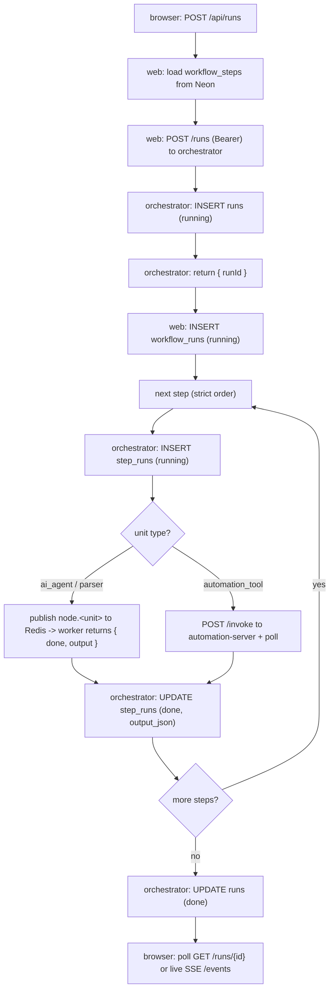

# A workflow run, end to end

What happens from the moment a user clicks "Start" to the moment step output is
persisted and shown.

## 0. Build (earlier, one time)

In the builder the user assembles steps and saves. The web writes to the Neon DB:
one `workflows` row + N `workflow_steps` rows. Nothing runs yet.

## 1. Start a run

From a session, the browser calls the web server route:

```
POST /api/runs   { workflowId, sessionId, input? }
```

`web/src/app/api/runs/route.ts`:

1. loads the workflow's steps from Neon (ordered by `order`),
2. builds the orchestrator payload (`steps[]` with stepKey, unitId, unitType,
   source, promptTemplate, dependsOn, humanInvolved, maxAttempts, timeoutSec,
   config),
3. calls the orchestrator with the bearer token:

```
POST http://<orchestrator>/runs      Authorization: Bearer <ORCH_API_TOKEN>
```

## 2. Orchestrator accepts and starts

`orchestrator/app.py :: create_run`:

1. validates every `ai_agent` step's `unitId` against the known catalog
   (rejects unknown unit IDs with 400 - this is what stops an attacker-chosen
   Celery task name),
2. `engine.create_run` inserts a row into **runs** (orchestrator-db, status
   `running`) and starts a **per-run daemon thread**, then returns `{ runId }`.

The web inserts a `workflow_runs` row (status `running`) linking
`orchestrator_run_id = runId`, and returns `runId` to the browser.

## 3. Per-run execution loop

`engine._schedule_loop` runs the steps **strictly in order**. The next step starts
only after the current one is `done`. Parallelism happens *between* runs (each run
has its own thread; the worker pool multiplexes their steps), never inside one run.

For each step (`_execute_step`):

1. build the step input (initial input + rendered `{{stepKey.output}}` variables
   from earlier steps),
2. write a `step_runs` row (status `running`) via `upsert_step`,
3. dispatch by unit type:
   - **ai_agent / parser** -> publish Celery task `node.<unitId>` to Redis. An
     idle worker pulls it, runs the unit (`node/*`), and returns
     `{ done, output }`. `excel_reader` decodes/parses the uploaded `.xlsx`
     (size-capped by `MAX_XLSX_BYTES`); `ai_agent` runs the prompt.
   - **automation_tool** -> HTTP `POST /invoke` to automation-server (with the
     automation bearer token), then poll `GET /invoke/{runId}` until done.
4. **re-ask loop**: if the unit reports `done=false`, wait `REASK_DELAY_SEC` and
   dispatch again with `attempt+1`, bounded by `maxAttempts` and `timeoutSec`. On
   breach the step is `failed` (`fail_reason = max_attempts_exceeded | timeout`)
   and the whole run becomes `failed`.
5. on `done=true`, write the final `output_json` to `step_runs` (status `done`).

## 4. Human-in-the-loop (optional)

If a finished step has `humanInvolved=true`, the run flips to
`paused_for_human` and the loop waits. It resumes only when:

```
POST /api/runs/{id}/resume  ->  POST /runs/{id}/resume   (bearer)
```

## 5. Completion

When the last step finishes, the run status becomes `done` (or `failed` earlier
on breach). `set_run_status` updates the **runs** row.

## 6. The UI sees progress

The browser watches a run two ways:

- **poll**: `GET /api/runs/{orchestratorRunId}` -> proxied to `GET /runs/{id}`,
  returning status + every step's input/output (read from orchestrator-db).
- **live**: `GET /api/runs/{id}/events` -> proxied SSE stream from
  `GET /runs/{id}/events`, pushing `step_status` / `run_status` events as they
  happen.

The web updates the `workflow_runs.status` row accordingly.

## Sequence (happy path)


