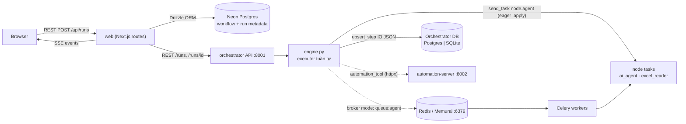
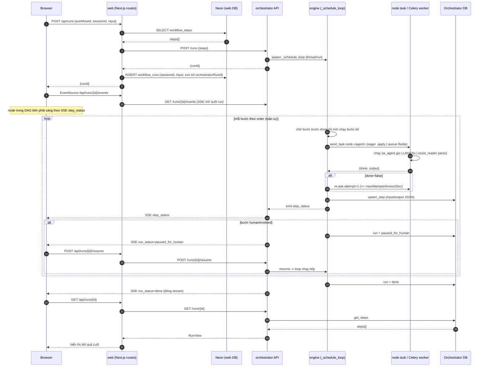
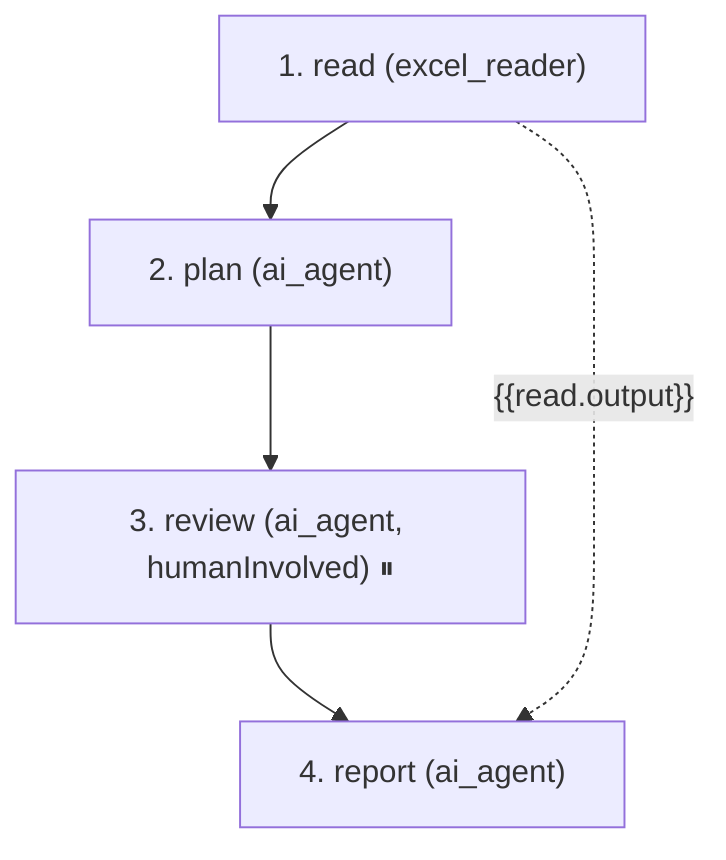

# Workflow Builder + AI Multi-Agent (PoC)

Dựng workflow nhiều bước, mỗi bước là một **unit** (AI agent chạy prompt, hoặc code tool
như Excel reader). Trong một run, các bước chạy **tuần tự theo thứ tự** đã dựng. Một
**orchestrator** điều phối: chạy từng bước theo order, đẩy việc lên hàng đợi từng agent
(worker rảnh tự kéo về), lưu input/output từng bước, hỏi lại (re-ask) agent nào báo "chưa
xong", và dừng chờ người duyệt (human-in-the-loop). Song song xảy ra **giữa nhiều run** khác
nhau (mỗi run một loop + worker pool phục vụ chéo), không phải giữa các bước trong một run.

## Kiến trúc tổng quan



Hai database TÁCH BIỆT:
- **Neon Postgres** (của web): chỉ giữ định nghĩa workflow + metadata run (1 dòng/run, có
  con trỏ `orchestratorRunId`). Bảng `workflows`, `workflow_steps`, `workflow_runs`.
- **Orchestrator DB**: giữ input/output JSON chi tiết từng bước (bảng `runs`, `step_runs`).
  Dùng Postgres nếu đặt `ORCH_DATABASE_URL`, không thì fallback SQLite file. Web KHÔNG lưu
  IO chi tiết mà truy vấn lại qua REST `GET /runs/{id}`.

## Tech stack

| Thành phần | Công nghệ |
|-----------|-----------|
| **web** | Next.js 14 (App Router), React 18, TypeScript, Drizzle ORM, Neon serverless Postgres. SSE qua `EventSource`. Migration/seed bằng `drizzle-kit` + `tsx`. |
| **ai-multi-agent** | Python 3.11+ (dev dùng 3.12), FastAPI + uvicorn, Celery 5.3, pydantic 2. Broker/result: Redis (Docker) hoặc Memurai (Windows). DB: psycopg3 + psycopg-pool (Postgres) hoặc `sqlite3` (fallback). Parser Excel: openpyxl. Client gọi automation: httpx. |
| **automation-server** | FastAPI (:8002). Dummy 7 automation tool. Tùy chọn, hiện chưa nối vào catalog của web. |
| **Hạ tầng chạy** | docker-compose (Redis + Postgres + api + workers + automation), hoặc chạy local (eager / Memurai). |

## Cấu trúc thư mục

```
ai-multi-agent/
  orchestrator/
    app.py        # FastAPI: /runs, /runs/{id}, /events (SSE), /resume, /catalog, /agents, /health
    engine.py     # executor tuần tự: _schedule_loop chạy step theo order, _execute_step
    events.py     # EventBus in-process (pub/sub cho SSE)
  node/           # các unit, mỗi unit là 1 Celery task
    ai_agent/ai_agent.py      # chạy prompt: gọi LLM thật nếu có AI_AGENT_KEYS, không thì echo dummy. task "node.ai_agent"
    parser/excel_reader.py    # đọc Excel -> rows (openpyxl). task name "node.excel_reader"
    _template.py  # template copy-paste để thêm tool mới (inert, chưa đăng ký)
    base.py       # run_step: khung done/re-ask/output chung
    registry.py   # SPEC-driven: derive UNITS/TASK_BY_AGENT/CATEGORIES/UNIT_IDS/QUEUES; điểm sửa duy nhất khi thêm tool
  shared/
    celery_app.py # Celery app + routing node.<name> -> queue:<name>; nhánh eager
    config.py     # đọc env
    db.py         # dual backend Postgres/SQLite, cùng interface
    clients.py    # automation_invoke (httpx tới automation-server)
    schemas.py    # pydantic: CreateRunRequest, StepSpec, RunView, StepView
web/src/
  app/
    page.tsx                # trang chủ: list workflow -> bấm mở list session
    workflow/[id]/page.tsx  # list session của 1 workflow + tạo session mới (chạy song song)
    builder/page.tsx        # dựng workflow (bước tuần tự; config params required/optional render generic từ SPEC; Input from; biến tham chiếu step trước)
    session/[id]/page.tsx   # chat theo session: run + SSE + DAG live (node sáng theo status)
    api/                    # route REST proxy sang orchestrator
      runs/route.ts, runs/[id]/{route,events,resume}, catalog, agents, workflows
      sessions/route.ts, sessions/[id]/{route,runs}   # CRUD session + list run để dựng lại lịch sử
  db/schema.ts              # Drizzle: workflows, workflow_steps, sessions, workflow_runs
  lib/services.ts           # AI_MULTI_AGENT_URL + orchHeaders() (ORCH_API_TOKEN)
contracts/openapi.yaml      # hợp đồng catalog + invoke + health dùng chung
docker-compose.yml
```

## Một lần chạy: luồng đi và giao tiếp giữa các phần



Kịch bản: người dùng ở `session/[id]` gõ yêu cầu (kèm file tùy chọn) rồi bấm Send.

Điều hướng: trang chủ list workflow -> bấm 1 workflow mở `workflow/[id]` (list session) ->
bấm **New session** tạo `session/[id]` rồi chat. Mỗi workflow có nhiều session độc lập; mở
nhiều session (nhiều tab) = chạy song song trên input khác nhau. Session lưu vào bảng
`sessions`; mỗi Send tạo 1 dòng `workflow_runs` gắn `sessionId` + `input`, nên mở lại session
sẽ dựng lại lịch sử chat từ các run cũ.

1. **Browser → web route (REST).** `send()` gọi `POST /api/runs` với `{ workflowId, sessionId, input }`.
   File Excel được đọc thành base64 nhét vào `input.file_b64`.

2. **web route → Neon (Drizzle).** `api/runs/route.ts` đọc các bước đã lưu của workflow từ
   `workflow_steps` (Neon, sắp theo `order`), dựng payload gồm `steps[]` (stepKey, unitId,
   unitType, dependsOn, promptTemplate, config, humanInvolved, maxAttempts, timeoutSec). Thứ
   tự trong `steps[]` chính là thứ tự chạy.

3. **web route → orchestrator (REST).** Gọi `POST {AI_MULTI_AGENT_URL}/runs` (mặc định
   `http://localhost:8001`). Orchestrator tạo `runId`, spawn một thread `_schedule_loop`
   (daemon) cho run này, trả `runId`. web ghi 1 dòng vào `workflow_runs` (Neon) với con trỏ
   `orchestratorRunId` rồi trả `runId` về browser.

4. **Browser → web → orchestrator (SSE).** Browser mở `EventSource('/api/runs/{id}/events')`;
   route này proxy sang `GET /runs/{id}/events` của orchestrator (`text/event-stream`).
   `EventBus` đẩy sự kiện `step_status` / `run_status` / `step_reask` theo thời gian thực.

5. **engine chạy tuần tự (trong orchestrator).** `_schedule_loop` duyệt `run.order` (thứ tự
   bước), chạy `_execute_step` cho từng bước và **chờ bước đó done rồi mới sang bước kế**. Không
   có dispatch song song trong một run. `dependsOn` không dùng để lập lịch — chỉ để builder biết
   bước tham chiếu output của bước trước nào.

6. **engine → agent (Celery).** `_execute_step` dựng input (render `promptTemplate` dạng
   `{{stepKey.output.path}}`; vì tuần tự, bước được tham chiếu luôn đã done nên resolve được),
   rồi `celery_app.send_task("node.<agent>", payload)`:
   - **Eager** (`CELERY_EAGER=1`): chạy task `.apply()` ngay trong chính thread của run. Không
     cần broker.
   - **Broker** (Memurai/Redis): task đẩy vào hàng đợi `queue:<agent>`; worker Celery rảnh kéo
     về chạy, trả kết quả qua Redis backend. Đây là phân phối pull-based đúng nghĩa. **Lập lịch
     = điều phối chéo**: worker phục vụ bước từ nhiều run đang ở các step khác nhau.

7. **agent chạy (node task).** `ai_agent` trả `{ text, system_prompt, user_prompt, provider, model }` (gọi LLM thật nếu `AI_AGENT_KEYS` có key dùng được, không thì echo dummy).
   `excel_reader` parse file trả `{ sheets, total_rows, ... }`. Mỗi task trả `{ done, output }`.
   Nếu `done=false` → engine **re-ask** (attempt+1) sau `REASK_DELAY_SEC`, giới hạn bởi
   `maxAttempts` và `timeoutSec`; vượt ngưỡng → bước `failed`, run `failed` (không lặp vô tận).

8. **engine → Orchestrator DB.** Mỗi lần bước đổi trạng thái, `db.upsert_step` ghi input/output
   JSON (Postgres hoặc SQLite). `_emit` bắn sự kiện → SSE → browser cập nhật khung chat.

9. **Human-in-the-loop.** Bước có `humanInvolved=true` xong → run chuyển `paused_for_human`,
   dừng dispatch. web hiện output + nút Continue → `POST /api/runs/{id}/resume` → orchestrator
   `resume` → `_schedule_loop` chạy tiếp.

10. **Kết thúc.** Mọi bước `done` → `run_status=done` → SSE đóng → browser gọi
    `GET /api/runs/{id}` (proxy `GET /runs/{id}`) lấy danh sách bước cuối để hiển thị đầy đủ.

Nhánh automation (nếu một bước `unitType=automation_tool`): engine gọi `automation_invoke`
(httpx) → `POST /invoke` rồi poll `GET /invoke/{id}` của automation-server. Hiện catalog của
web chỉ trả unit AI nên nhánh này ở trạng thái chờ, chỉ chạy khi bước được dựng tay.

Ví dụ một workflow: mũi tên **liền** = thứ tự chạy (tuần tự theo order); mũi tên **đứt** =
tham chiếu biến (một bước chèn output bước trước vào prompt, không đổi thứ tự chạy).



- Chạy đúng thứ tự `read → plan → review → report`, mỗi bước chờ bước trước `done`.
- `review` có `humanInvolved` → xong thì run `paused_for_human`, chờ Continue mới tới `report`.
- `report` tham chiếu `{{read.output}}` (chọn `read` ở ô "Input from" trong builder) → vẽ
  mũi tên đứt. Vì `read` chạy trước nên biến luôn resolve được; thứ tự chạy không đổi.

## Cách chạy

Web dùng Neon (đã online). Backend chọn 1 trong 2 cách.

### Cách A — Docker (đầy đủ: Redis + Postgres orch + workers + automation)

Cần Docker Desktop.

```bash
docker compose up --build
```

Dựng: `redis` (:6379), `orchestrator-db` (Postgres :5432), `ai-multi-agent-api` (:8001),
`ai-multi-agent-workers` (pool = `WORKFLOW_CONCURRENCY` x `SESSION_CONCURRENCY`, mặc định 1,
derive trong `worker.sh`), `automation-server` (:8002). api + workers tự nhận
`ORCH_DATABASE_URL` trỏ vào Postgres container.

### Cách B — Local, Celery workers thật (broker Memurai, không Docker)

Redis không chạy native Windows → dùng **Memurai** (Redis-compatible, service Windows,
cổng 6379) hoặc Redis trong WSL. Broker chạy rồi thì mở 3 terminal, KHÔNG đặt `CELERY_EAGER`:

```powershell
# Terminal 1 - API (broker mode)
cd ai-multi-agent
$env:PYTHONPATH="$PWD"
$env:REDIS_URL="redis://localhost:6379/0"
py -3.12 -m uvicorn orchestrator.app:app --host 127.0.0.1 --port 8001

# Terminal 2 - Celery worker (pool=threads BẮT BUỘC trên Windows; prefork cần fork())
cd ai-multi-agent
$env:PYTHONPATH="$PWD"
$env:REDIS_URL="redis://localhost:6379/0"
# queues derived from the registry (new tools picked up automatically)
$Q = py -3.12 -c "from node.registry import QUEUES; print(','.join(QUEUES))"
py -3.12 -m celery -A shared.celery_app.celery_app worker `
  -Q $Q --pool=threads --concurrency=6 --loglevel=info

# Terminal 3 - web
cd web
npm run dev
```

### Web (thiết lập lần đầu)

```bash
cd web
cp .env.example .env        # đặt DATABASE_URL = URL Neon
npm install
npm run db:push             # tạo bảng trên Neon
npm run db:seed             # (tùy chọn) seed workflow demo
npm run dev                 # http://localhost:3000
```

web đọc backend qua `AI_MULTI_AGENT_URL` (mặc định `http://localhost:8001`) nên nếu chạy
đúng cổng thì không cần đổi gì.

## Deploy trên một máy khác (full process)

Chạy toàn bộ hệ thống trên máy B. Backend qua Docker (Cách A) để đỡ cài Memurai/Postgres tay;
web chạy riêng bằng `npm`. Neon là cloud nên cùng `DATABASE_URL` dùng được từ mọi máy.

**Cái gì chạy ở đâu:** `docker compose` dựng redis + orchestrator-db (Postgres) +
automation-server + api + workers. Web (Next.js) KHÔNG nằm trong compose, chạy riêng.

**Điều kiện máy B:** Docker Desktop (hoặc Docker Engine + compose), Node.js 18+, git.

```bash
# 1. Lấy code
git clone <repo-url> AIVL
cd AIVL

# 2. Secret backend (không có trong git). Root docker-compose đọc ROOT .env cho
#    REDIS_PASSWORD, ORCH_DB_PASSWORD, ORCH_API_TOKEN, AUTOMATION_API_TOKEN, API_BIND.
cp .env.example .env

# 3. Secret web (không có trong git; chứa Neon credential thật)
cp web/.env.example web/.env
#    Sửa web/.env:
#      DATABASE_URL=<chuỗi Neon pooled thật>   # chuyển an toàn từ máy A, KHÔNG commit
#      AI_MULTI_AGENT_URL=http://localhost:8001
#      ORCH_API_TOKEN=<khớp ORCH_API_TOKEN trong ROOT .env>   # bắt buộc khi backend bật token

# 4. Backend (1 lệnh): redis + orch-db + automation + api :8001 + workers
docker compose up --build

# 5. Web (terminal khác)
cd web
npm install
npm run db:push     # idempotent; đảm bảo schema trên Neon
npm run dev         # http://localhost:3000
```

Kiểm tra: `curl http://localhost:8001/health` → `{"ok":true}`. Mở http://localhost:3000.

**Truy cập UI từ máy khác qua LAN:** web proxy gọi api server-side (localhost:8001 trên máy B)
nên chỉ cần expose cổng 3000:

```bash
cd web && npm run dev -- -H 0.0.0.0
```

Máy khác mở `http://<IP-máy-B>:3000`. Cổng 8001/8002 giữ nội bộ máy B, không cần mở.

**Native (không Docker):** giống Cách B, cần thêm Python 3.12 + Memurai trên máy B, chạy 3
terminal (api + worker + web). Dài và dễ lệch env hơn Docker.

## Kiểm tra nhanh

```bash
curl http://localhost:8001/health     # {"ok":true}
curl http://localhost:8001/catalog    # 2 unit: ai_agent, excel_reader
curl http://localhost:8001/agents     # busy/idle từng agent

# Chạy thử 1 run 2 bước qua REST
curl -s -X POST http://localhost:8001/runs -H 'content-type: application/json' -d '{
  "workflowId": "demo",
  "input": {"request": "hello"},
  "steps": [
    {"stepKey":"read","unitId":"excel_reader","unitType":"ai_agent","source":"ai"},
    {"stepKey":"plan","unitId":"ai_agent","unitType":"ai_agent","source":"ai","dependsOn":["read"],"promptTemplate":"rows={{read.output.total_rows}}"}
  ]
}'
# -> {"runId":"..."}; rồi:
curl http://localhost:8001/runs/<runId>
curl -N http://localhost:8001/runs/<runId>/events    # SSE
```

Trong một run: `read` xong mới tới `plan` (tuần tự); `plan` resolve `{{read.output.total_rows}}`
từ output của `read`. Song song **chéo run**: bắn 2 run cùng lúc (2 session khác nhau) → chúng
chạy đồng thời. DAG bên phải `session/[id]` sáng node theo `step_status`; hoặc xem
`GET /agents` (`busy`/`idle` từng agent) / log worker.

## Biến môi trường

| Service | Biến |
|---------|------|
| ai-multi-agent | `REDIS_URL`, `ORCH_DATABASE_URL`, `SQLITE_PATH`, `CELERY_EAGER`, `AUTOMATION_SERVER_URL`, `ORCH_API_TOKEN`, `AUTOMATION_API_TOKEN`, `DEFAULT_SIMULATE_INCOMPLETE`, `DEFAULT_MAX_ATTEMPTS`, `REASK_DELAY_SEC`, `MAX_XLSX_BYTES`, `SESSION_CONCURRENCY`, `WORKFLOW_CONCURRENCY` |
| automation-server | `PORT`, `AUTOMATION_API_TOKEN` |
| web | `DATABASE_URL` (Neon), `AI_MULTI_AGENT_URL`, `ORCH_API_TOKEN` |
