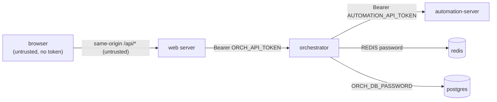

# Security model

Target: safe to operate for an org of ~100-200 users, with the two backend stacks
and the web app potentially on different machines.

## Trust boundaries

- The browser is untrusted. It never holds a token and never reaches a backend
  directly (all traffic goes through same-origin `/api/*`).
- Every server-to-server hop is authenticated (bearer token or DB/broker password).
- redis and orchestrator-db are never exposed to a host port.

## What is enforced in code

| Control | Where | Effect |
|---------|-------|--------|
| Bearer auth on the orchestrator | `orchestrator/app.py` `_require_token` | every route except `/health` needs `Authorization: Bearer <ORCH_API_TOKEN>`; constant-time compare |
| Bearer auth on automation-server | `automation-server/main.py` `_require_token` | same, with `AUTOMATION_API_TOKEN` |
| web attaches the token | `web/src/lib/services.ts` `orchHeaders()` | server-side only; token never sent to the browser |
| orchestrator attaches the token to automation | `shared/clients.py` `_auth_headers()` | authenticates the orchestrator -> automation hop |
| unitId validation on `POST /runs` | `orchestrator/app.py` | rejects unknown `ai_agent` unit IDs, so an attacker cannot choose the Celery task name |
| upload size cap | `node/parser/excel_reader.py` + `MAX_XLSX_BYTES` | rejects oversized `.xlsx` before parsing (zip-bomb / OOM guard) |
| Redis password | compose `--requirepass` + `REDIS_URL=redis://:pw@...` | broker is not open; blocks anonymous task injection |
| Postgres password | compose `ORCH_DB_PASSWORD` | DB not `orch/orch` |
| no exposed broker/DB ports | compose (redis, orchestrator-db) | reachable only inside the compose network |
| parameterized SQL everywhere | `shared/db.py`, Drizzle | no SQL injection (see database.md) |
| prompt templating is string substitution | `engine._render_prompt` | `{{...}}` is regex replace, not `eval` - no template/code injection |

### Auth is opt-in by config

If a token env var is **empty**, that service's auth is **disabled** and it logs a
warning at startup. This keeps local dev frictionless. **For any deployment the
tokens must be set.** Treat an empty token in production as a critical
misconfiguration.

## What you configure per deployment (not code)

Code auth protects the *application layer*. It does not encrypt the wire or hide
the ports. For cross-machine deployment add a transport layer - pick one:

1. **Private overlay network (recommended).** Put the machines on Tailscale or
   WireGuard. Keep `API_BIND` / `AUTOMATION_BIND` on the overlay interface (or
   `127.0.0.1` plus the overlay), and **do not** expose any backend port to the
   public internet. The web host joins the same tailnet and reaches the
   orchestrator by its overlay address. Smallest attack surface, least ops.
2. **Reverse proxy with TLS.** Front the orchestrator (and automation-server) with
   Caddy / nginx / Traefik terminating HTTPS (Let's Encrypt). Keep the bearer
   token behind it. Use when a backend must be reachable on the public internet.
3. **mTLS.** Both sides present certificates. Strongest, heaviest to operate;
   worth it for multi-tenant or strict-compliance setups.

Additional hardening to apply at the proxy/overlay layer (not in this codebase):

- **Rate limiting** (per IP / per token) - do it at the reverse proxy; an
  in-process limiter is unreliable across multiple workers.
- **Firewall** - allow 8001/8002 only from the web host / orchestrator host.
- **Web app authentication** - this repo has no end-user login. Add real user
  auth (e.g. NextAuth) in the web app before exposing the UI to 100-200 users.

## Secrets

- Generate every token/password with `openssl rand -hex 32`.
- Store them in each service's `.env` (git-ignored) or a secret manager. Never
  commit `.env`. `web/.env` in particular holds the real Neon URL.
- Rotate by changing the value in every stack's `.env` and restarting; because
  they are symmetric shared secrets, both ends must change together.

## Production checklist

- [ ] `ORCH_API_TOKEN`, `AUTOMATION_API_TOKEN`, `REDIS_PASSWORD`, `ORCH_DB_PASSWORD`
      all set to strong random values (not the `change-me-*` placeholders).
- [ ] web `ORCH_API_TOKEN` matches the orchestrator's.
- [ ] orchestrator and automation-server share the same `AUTOMATION_API_TOKEN`.
- [ ] no backend port exposed to the public internet (overlay or firewall).
- [ ] transport encrypted (overlay or TLS).
- [ ] redis / orchestrator-db have no published host port.
- [ ] web app has end-user authentication.
- [ ] rate limiting at the proxy.
